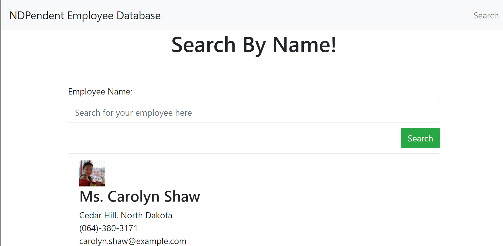
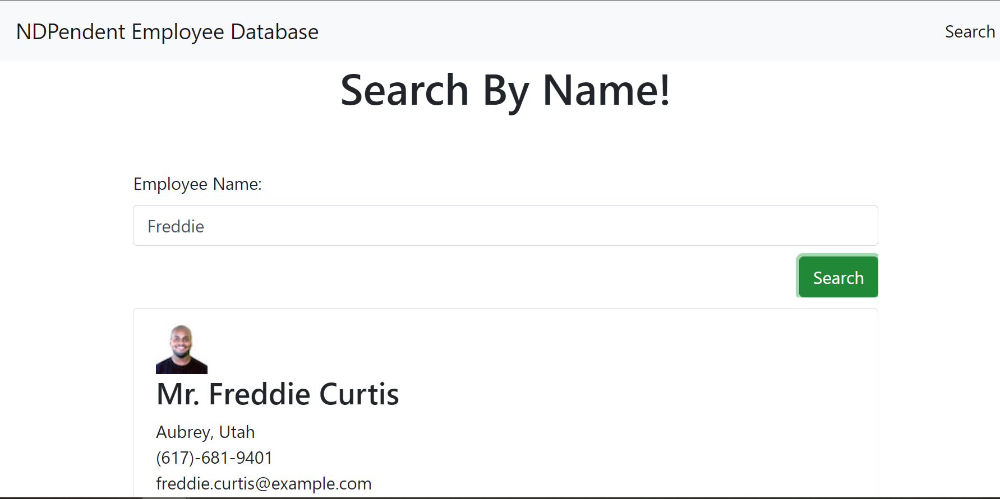

# NDPendentCoder_Employee_Directory

This app is meant to showcase not only the "React" App, but its functionality to create a working web page and dynamically filter through a list of employees.

# Tools Used
1. React 
2. API "https://randomuser.me/api/"

# Uses
This can be used as an example to show how you can pull from a list of users and or employees to create readable cards for all of them and the necessary data you would like to display in either a classified or non classified way. 

This also shows how fast the react virtual dom is able to compute any data changes and display it immediately to the webpage without taxing the users on the front end. 

# Thanks
Many thanks to my tutor, Namita, and my instructors Lee and Chad for helping me to understand React and its many uses in the world of web-building. 

# Contact
You can contact me at:
1. Email: nicolai.pitroff@gmail.com
2. github: https://github.com/NPitroff/
3. Linked-In: https://www.linkedin.com/in/nicolaipitroff/

# Links
1. To Github :https://github.com/NPitroff/NDP_EmployeeDatabase
2. Heroku: https://ndpendent-employee-database.herokuapp.com/

# Screenshots

